# Gamers Beginning's

This is a website is a page for anyone of any age that wants to get into gaming and wants to look at the very basics of what they will need in order to help them achevie building their own pc setups and use this as a checklist for parts.

Users will be able find about the website and its goals, link to part picker to ensure they all the right components, social media links, parts list and a form to win a pc.

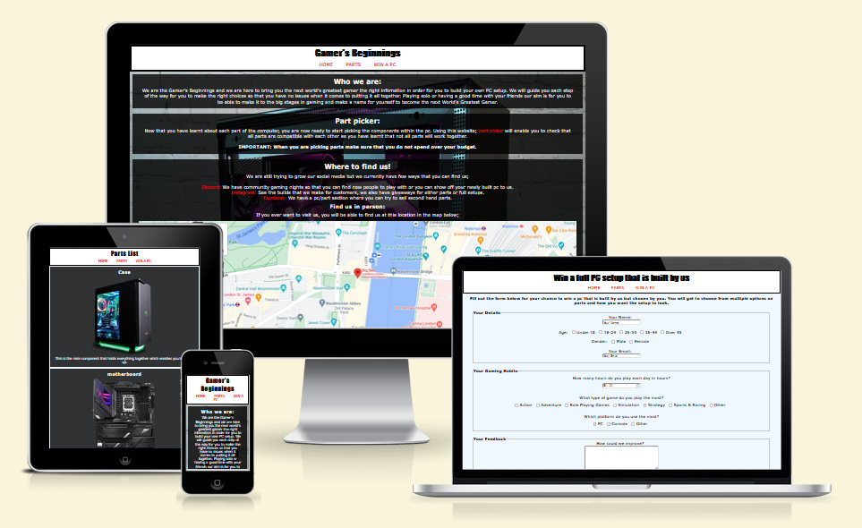

# Contents

- [Gamers Beginning's](#gamers-beginnings)
- [Contents](#contents)
  - [Target Audience](#target-audience)
  - [Design](#design)
  - [Wireframes](#wireframes)
- [Features](#features)
- [Testing](#testing)
  - [Validation](#validation)
  - [Lighthouse](#lighthouse)
  - [Testing using devices](#testing-using-devices)
- [Deployment](#deployment)
- [Credits](#credits)
  - [Content](#content)
  - [Media](#media)
  - [Acknowledgments](#acknowledgments)

## Target Audience
The target audience for the site is anyone of any age and gender that wishes to know what parts they will need to buy when they want to build their own pcs. The website if simple enough to understand and read with the constrast of the pages and images, the main index page has short description about the social media links with a map about seeing us in person and has a question form to ask for more infomation. Parts list has a side scrolling gallery with headings and berif text about each part. There is a win a pc form with a varitiy of questions about the user and a feedback form. 

## Design
 **Font**
 I used (https://blog.hubspot.com/website/web-safe-html-css-fonts) when searching for fonts. 

- Fonts that were used;
	 - Verdana (main text)
	 - Impact (main page headings)
	 - Tahoma (page headings)

**Colours**

- The main background for the site is Aliceblue as it made for a nice mellow background
- The main text boxs and parts page are made black with lower opacity.
- The footer is orange as it contrasts the main body well with white icons for good visibility for them.
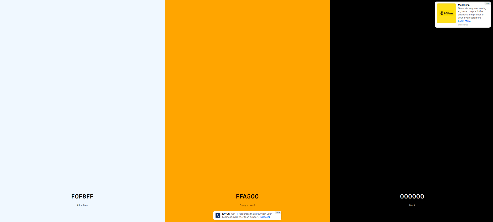
 
## Wireframes

**Home**

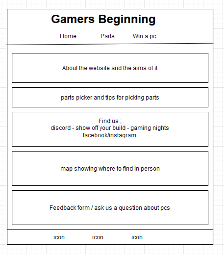

**Parts list**

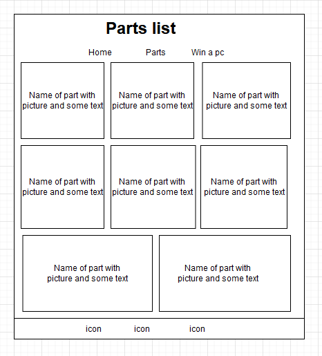

**Win a PC**

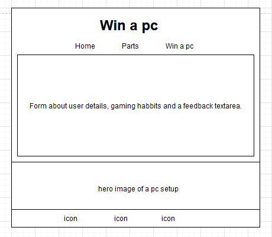

Draw.io was used to make the wireframes.

# Features

 -**Nav bar**
 
This is featured on all pages with the links to the home page, parts list and win a pc form. This is the same on each page to allow ease of use.

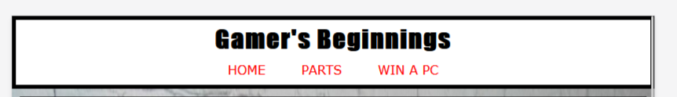

 - **Home page**

The home page has a small area of text to explain what the site is about the aims it hopes to acheive, then it has a useful link for users to be able to make sure that all the parts they have picked will be compatible. It has the main three social media links that are not apart of the footer, this will be valuble to the user as this is one of the main ways for the site to make a community on platforms and have activities on these platforms. More info about these would be found by clicking the links.

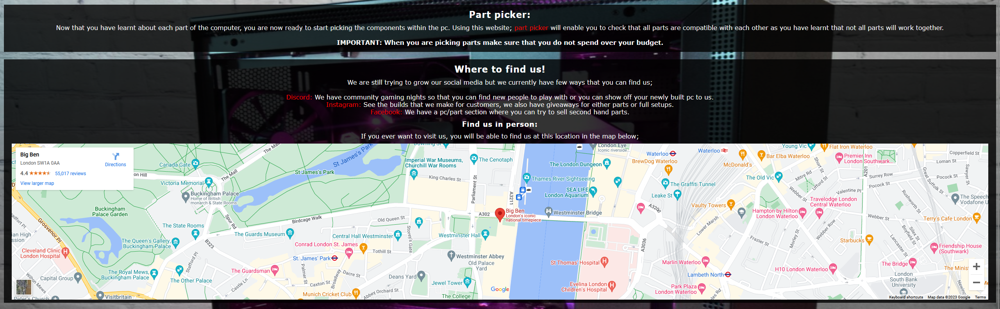
 
 -**Images for parts**

Will provide a visual checklist for users to make sure they have all parts needed to build setup. 
 
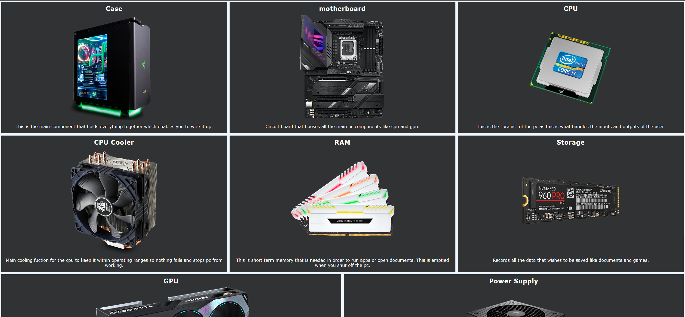
 
 - **Win a pc form**

This allows users to sign up for a competiton to win a pc by asking users about themselves and what they do. There is a feedback area for them to help make sure that the site is helpful and able to add anything that may have been missed or redo content.

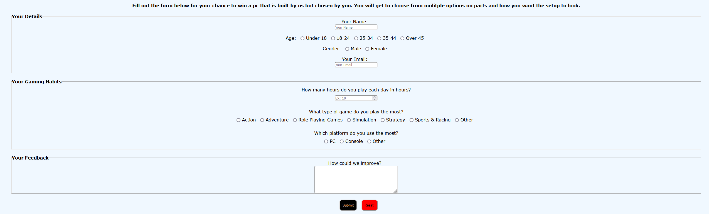
 
 -**Footer**
 I used three icons for the social media; discord, facebook and instragram. These icons are sourced from font awesome, the colors were changed to white to contrast the orange background so they are easier to see.
 
 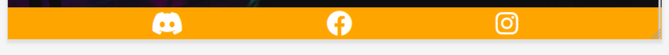

 **Future features to implement**
 Over time i would update the parts page to have clickable images for each one that would open in a new page that would go into greater details about the part.

 **Accessibility**
 For screen readers i have used the aria-labels and semantic elements for an easier experience of the website.

# Testing

## Validation

 - HTML
	 - With the use of [W3C validator](https://validator.w3.org/nu/?doc=https%3A%2F%2Flostlogo1.github.io%2FGamers-Beginnings%2F) there were some errors found at first but fixed and now passes.

 - CSS
	 - With the use of [Jigsaw](https://jigsaw.w3.org/css-validator/validator?uri=https%3A%2F%2Flostlogo1.github.io%2FGamers-Beginnings%2F&profile=css3svg&usermedium=all&warning=1&vextwarning=&lang=en) there were no errors found and passes.

## Lighthouse
I used Firefox's lighthouse extenstion to check the performance of the site. 

**Index page**

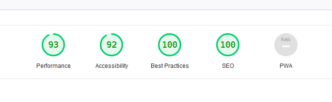

**Parts page**

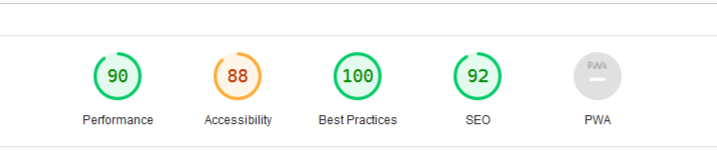

**Win a pc page**

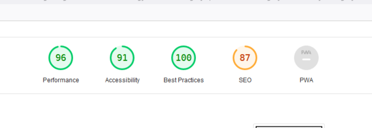

## Testing using devices
Testing was preformed on the following;

 - Browsers
	 - Google chrome
	 - Firefox
	 - Safari
 - Devices
	 - Iphone 13 pro max
	 - Desktop
 
 Having friends that used different types of screen sizes and devices, they tested each section of the site from each page to ensure that all links in the pages and nav bar and the icons worked in the footer. None reported any faults.

# Deployment
This site was deployed onto Github Pages.

 - To deploy the site as follows;
	 - Go to the GitHub repository and find the settings
	 - Select the "pages" tab on the left-hand side
	 - Make sure that the "main branch" has been selected and click save.
	 - Wait for the site to refresh and wait for the deployment to finish.
 - Live link - [https://lostlogo1.github.io/Gamers-Beginnings/](https://lostlogo1.github.io/Gamers-Beginnings/)

# Credits

## Content 
All of the code was written by myself but using the code institute learning materials and the love running code as sources. With the use of (https://stackoverflow.com/) and (https://www.w3schools.com/) to try to answer any questions or questions that other people have posted to clear any confustion that i had.
 

## Media
Images that were used on the parts page were from (https://pnghut.com/) as this allowed for the pictures to have the backgrounds deleted making for the page to look for sleek.

The hero image on the form page was found using google images and pulled from (https://www.enostech.com/how-to-boost-the-performance-of-my-gaming-computer/)

Used (https://fontawesome.com/) for the icons in the footer. 

## Acknowledgments
A huge thank you to my mentor Luke Bunchanan for giving me many pointers and guidence in which to take the site as it started off in the wrong direction.
Idea for the site came from my girl firend after building desktops with her as she had no idea what parts needed to be in a desktop. 